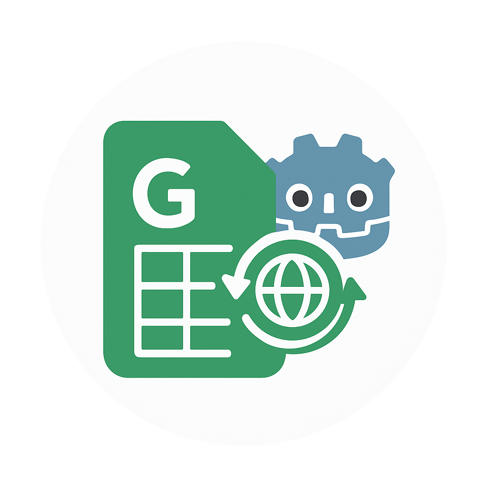
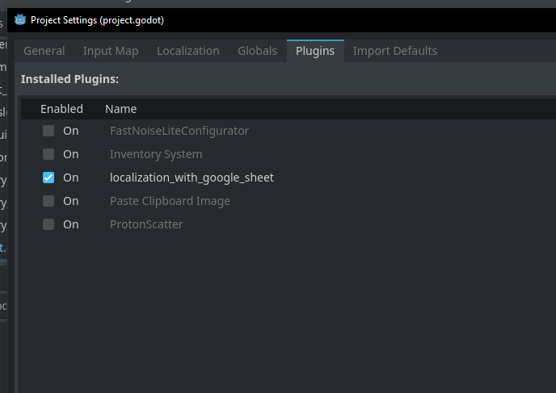
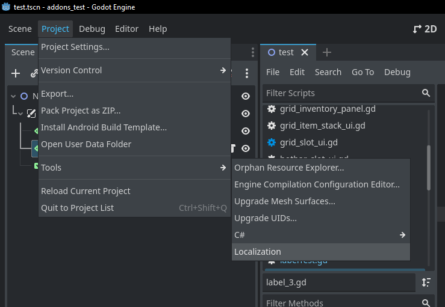
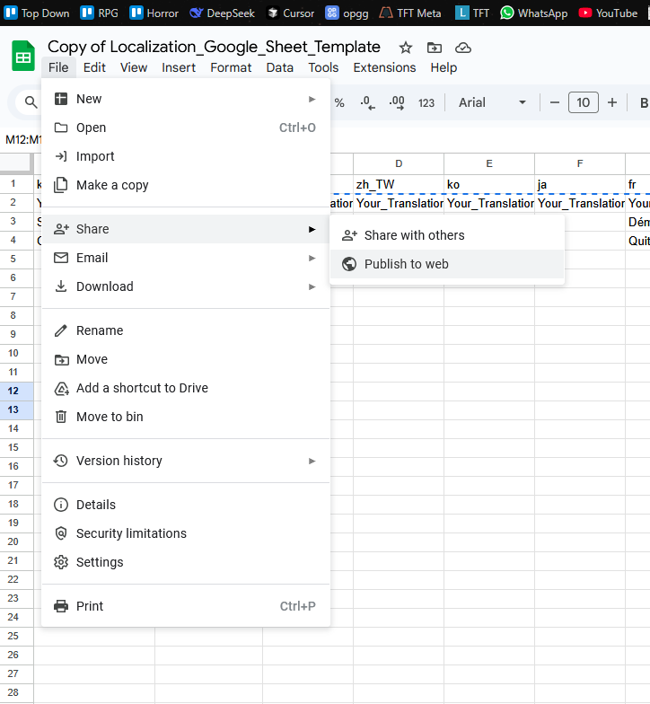
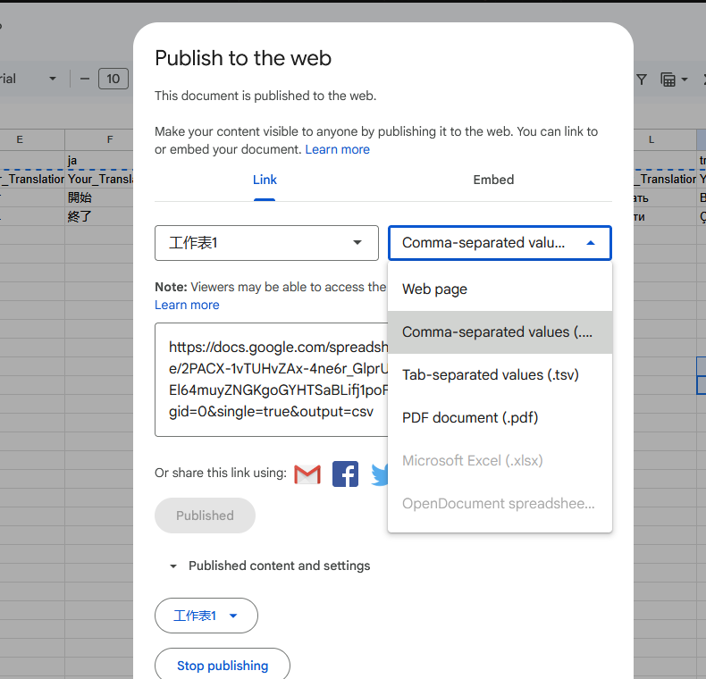

  

# Localization with Google Sheet (Godot Addon)

A Godot Engine addon that helps you manage game localization using Google Sheets. Automatically sync translations from Google Sheets to your Godot project and generate type-safe enum files for both GDScript and C#.

## Features

- 🔄 **Direct Google Sheets Integration**: Fetch translations directly from Google Sheets
- 🎯 **Type-Safe Enums**: Automatically generates enum files for both GDScript and C#
- 📂 **Multiple Workspaces**: Manage multiple translation sheets for different parts of your game
- 🛠️ **Editor Integration**: Convenient UI panel in the Godot editor under "Project > Tools > Localization"
- 📦 **CSV Export**: Automatically exports translations to CSV files in your project
- 🔌 **Project Settings Integration**: Automatically registers translations in your project settings

## Installation

1. Download this addon
2. Copy the `addons/localization_with_google_sheet` folder into your project's `addons` directory
3. Enable the plugin in Godot (Project > Project Settings > Plugins)

## How to Use

1. **Enable the Plugin:**
   - Go to `Project > Project Settings > Plugins` in the Godot editor.
   - Find `localization_with_google_sheet` in the list and enable it.
   -  <!-- Add this screenshot if available -->
2. **Access the Addon:**
   - Go to `Project > Tools > Localization` in the Godot editor menu.
   -  <!-- Add this screenshot if available -->
3. Use the Localization panel to manage your workspaces and sync with Google Sheets.

## Quick Start

1. Click "Project > Tools > Localization" in the Godot editor
2. Click "Template" to see the required Google Sheet format
3. Create your Google Sheet following the template
4. **Publish your sheet** (see Google Sheet Setup below)
5. In the Localization panel:
   - Click "+" to add a new workspace
   - Enter a name for your workspace
   - Paste your Google Sheet URL
   - Click "Refresh" to fetch translations

## Workspace Structure

Each workspace creates:

- `data/localization/<workspace_name>/` - Contains CSV files
- `addons/localization_with_google_sheet/enum_gd/<workspace_name>_localization_key.gd` - GDScript enums
- `addons/localization_with_google_sheet/enum_csharp/<workspace_name>_LocalizationKey.cs` - C# enums

## Google Sheet Setup

1. Create a new Google Sheet
2. Click the "Template" link in the addon to see the required format
3. **Important: Publish your sheet to the web**:

   - Click `File > Share > Publish to web`

     

   - In the first dropdown, select your specific worksheet (e.g., "工作表 1" or your sheet name)
   - In the second dropdown, select "Comma-separated values (.csv)"

     

   - Click "Publish"
   - Click "OK" on the confirmation popup
   - Make sure the "Published" status appears

4. Copy the sheet URL from your browser's address bar
5. Paste the URL in the addon's workspace settings

⚠️ **Important Notes:**

- The sheet must remain published for the addon to work
- Make sure you've selected the correct worksheet, not "Entire Document"
- The format MUST be "Comma-separated values (.csv)"
- If you make changes to your sheet, you may need to click "Share > Publish to web" again to update the published version

## Components

The addon is organized into several components:

- **WorkspaceManager**: Handles CRUD operations for translation workspaces
- **CSVFetcher**: Downloads CSV data from Google Sheets
- **TranslationRegistrar**: Processes CSV files and registers translations
- **EnumGenerator**: Generates type-safe enums from translation keys
- **LayoutManager**: Manages the editor UI
- **LocalizationUtils**: Utility functions for URL processing and file operations

## Tutorial

Click the "Tutorial" link in the addon panel to watch video tutorials on how to use this addon effectively.

## Contributing

Contributions are welcome! Feel free to submit issues and pull requests.

## License

This project is licensed under the MIT License. See [LICENSE](LICENSE) for details.

## Links

- [Google Sheet Template](https://docs.google.com/spreadsheets/d/1qpASVrKa8W4SQscppcuo9j0iQWIaM2IlscuIX52MmwY/edit?usp=sharing)
- [Video Tutorials](https://www.youtube.com/watch?v=mX8JiJAYOEo)
